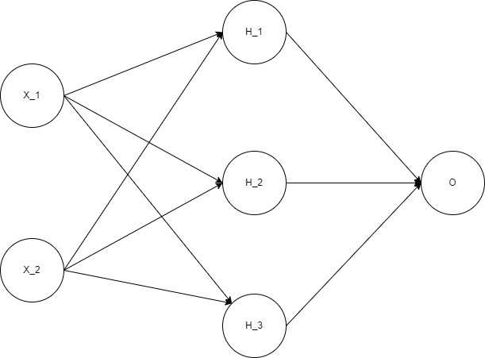

# Red Neuronal Básica. 

La onda es hacer una red neuronal que siga el estilo de la foto de abajo. La cantidad de neuronas e imputs es variable. Las funciones de activación de todas las neuronas es la sigmoide.

Los parámetros son inicializados de forma normal (media = 0, desvío = 1).

Se aplica una regularización L2.

